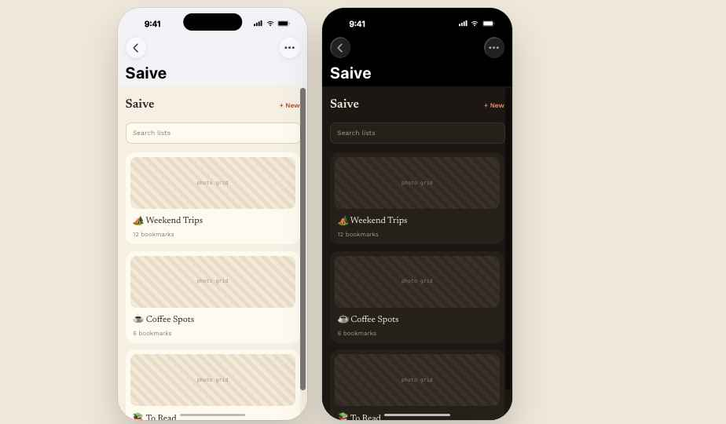
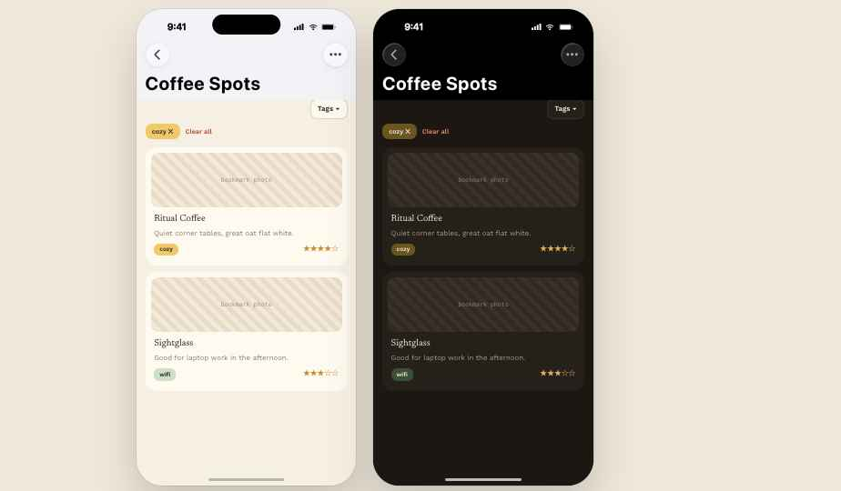
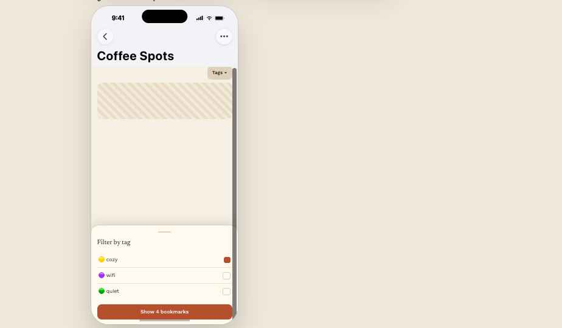
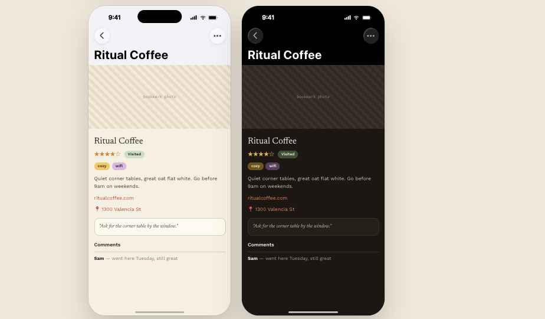

# Saive — Journal Theme (design doc)

## Mockups

| | |
|---|---|
|  Home — light |  Home — dark |
|  List detail — light |  List detail — dark |
|  Tag filter bottom sheet | |
|  Bookmark detail — light |  Bookmark detail — dark |


A new warm, personal "scrapbook" theme for the mobile app (Expo + NativeWind), added
alongside the existing Pixel and Modern themes — same token architecture
(`THEME_TOKENS`, `tailwind.config.js` skin vars), new palette + type + component
treatment. Ships light + dark.

## Screens covered

- **Home** (`/`) — lists you own or belong to, search — *priority*
- **List detail** (`/lists/[id]`) — bookmarks in a list, tag filter, comments — *priority*
- **Bookmark detail** (`/lists/[id]/bookmarks/[bid]`) — hero photos, rating, tags, notes, comments — *priority*
- **Nearby** (`/nearby`) — compact rows, distance, radius chips — spec only, reuse primitives
- **New bookmark, Settings, Onboarding, Login, Invite** — spec only, reuse primitives

## Color tokens — `JOURNAL_LIGHT` / `JOURNAL_DARK`

Drop-in additions to `THEME_TOKENS` in `mobile/src/theme/tokens.ts` — same 11 keys,
no new infra. Adds a third theme family alongside Pixel/Modern.

```ts
JOURNAL_LIGHT: {
  bg: '#f6efe4', panel: '#fffaf0', ink: '#2e2620', muted: '#8a7c6c',
  primary: '#b5502f', primaryInk: '#fff8f0', accent: '#c98a2c',
  danger: '#b23b3b', success: '#4f7a4a', warning: '#c98a2c', border: '#ded0ba',
},
JOURNAL_DARK: {
  bg: '#1c1712', panel: '#26201a', ink: '#f2e9dc', muted: '#a89787',
  primary: '#e08a5f', primaryInk: '#1c1712', accent: '#e0b25a',
  danger: '#e07a6b', success: '#7fae70', warning: '#e0b25a', border: '#3a3128',
},
```

`border-w`: 1px (thin, like Modern). `radius`: 20px / `radius-sm`: 12px — softer and
larger than Modern's 16px/8px, for a rounded, hand-placed paper feel. Existing
per-tag colors (`tag-colors.ts`) carry over unchanged.

## Typography

- **Newsreader** (serif), weight 500–600 — list/bookmark names, screen titles.
  Italic weight for empty-state/annotation copy (e.g. `"No bookmarks yet — add your
  first find."`).
- **Work Sans**, weight 400–600 — everything functional/UI: body copy, descriptions,
  comments, buttons.

## Component patterns

- **Photo-forward list card** — Home lists & in-list bookmark feed: a landscape
  photo (first extracted image, or a warm tinted placeholder) with a slight white
  "print border," title in Newsreader below, tag pills + rating underneath.
- **Compact row** — Nearby & search results: small square thumbnail, name + list
  icon/name, distance or muted meta on the right. No large photo, optimized for
  scanning many results.
- **Rating** — keep the 5-star glyph rating (`StarRating.tsx`/bookmark detail),
  recolor filled stars to `accent` gold instead of the old yellow/warning token.
- **Tag pills** — same per-tag colored pills, softened to fully-rounded
  (radius-sm 12px), lowercase label, no border — matches the Modern theme's
  existing `[data-theme^="modern"] .pixel-tag` treatment, ported to `JOURNAL_*`.
- **Comments** — left-aligned avatar-less rows, author name in Work Sans 600, warm
  hairline divider between entries, newest first (unchanged behavior).
- **Primary button** — filled `primary` terracotta, radius-sm, `primaryInk` label,
  Work Sans 600.

## List detail — tag filter redesign

Tag chips move out of the scrolling content into the screen header, next to the
list title: a small **"Tags ▾"** button opens a bottom sheet with a checkable list
of every tag used in this list (multi-select, OR filter — unchanged logic). The
header stays put on scroll. Selected tags render as a pills row (with ✕ per pill +
Clear all) directly under the header — that row is only present once ≥1 tag is
selected; with nothing selected it collapses away entirely, so an unfiltered list
shows no reserved empty space. No count badge on the header button.

**Implementation:** in `mobile/src/app/lists/[id].tsx`, move the `availableTags` row
out of the scrolling `FlatList` content into `Stack.Screen`'s `headerRight` as a
"Tags ▾" button; its `onPress` opens a bottom sheet (e.g. `@gorhom/bottom-sheet`,
already idiomatic in Expo) rendering the same toggle-list interaction, keyed off the
existing `selected` Set / `toggleTag` logic — no filtering logic changes, only where
the picker UI lives. Render the pills row (existing ✕/Clear all pattern)
conditionally — only when `selected.size > 0` — directly below the header instead of
always-visible above the list.

## NativeWind implementation notes

- Add `JOURNAL_LIGHT`/`JOURNAL_DARK` to `ThemeName` + `THEME_TOKENS` in
  `mobile/src/theme/tokens.ts`, mirrored in web's `globals.css`
  (`data-theme="journal-light"` / `"journal-dark"`) and the settings/onboarding
  4→6-option theme picker (`THEME_OPTIONS` in `web/src/lib/theme.ts`).
- No new Tailwind utilities needed — same `bg-bg`/`text-ink`/`bg-primary`/
  `border-skin`/`rounded-skin` classes, just new CSS-var values via `themeVars()`.
- Load `Newsreader` via `expo-font`; fall back to system serif until loaded. Work
  Sans can replace the current default system sans app-wide for this theme, or stay
  system font if that's simpler to ship first.
- Photo-forward cards need a soft drop shadow, which `border-skin` alone doesn't
  give — add a small shared `cardShadow` style object (RN `shadow*`/`elevation`
  props) alongside the border-radius tokens, applied via `style=` since NativeWind
  shadow utilities are inconsistent cross-platform.
- Rebuild `ListCard`/list-page bookmark rows to show the first `images[]` entry
  (existing field, currently only shown on detail) — this is the single biggest
  visual lift for the new theme.

## Open questions

- Should Journal become the new *default* theme, or sit alongside Pixel/Modern as a
  third pick in settings?
- Bookmarks without a photo yet — solid warm placeholder tile (as mocked) or fall
  back to compact row even in list view?
- OK to bundle a new Google/expo font (Newsreader) or should headings stay on a
  system serif for load-time reasons?
